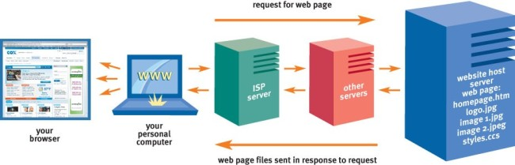

# How the **Web** works

The Web is known as a *client-server system*. Your computer is the *client* and the remote computers that store electronic files are the *servers*.
When you enter something like Google.com the request goes to one of many special computers on the Internet known as Domain Name Servers (DNS).
All of these requests are then routed through various routers and switches.
The domain name servers keep a table of machine names and their IP address'.
so when you type in Google.com it gets translated into a number, which identifies the computers that serve the Google Website to you.
When you want to view a web page, you must initiate the activity by requesting a page using your browser.
The browser then asks a domain name server to translate the domain name you requested into an IP address.
The browser then sends a request to that server for the page you want, using a standard called Hypertext Transfer Protocol (HTTP).
Information is sent around the world via fibre optic cables, the data is broken down into 6-bit '**packets**', and sent in binary code.
This binary code is then translated back in to its original code once all the **packets** have been recieved.
The browser then collects all of the information, and displays this to your computer in the form of Web page.

